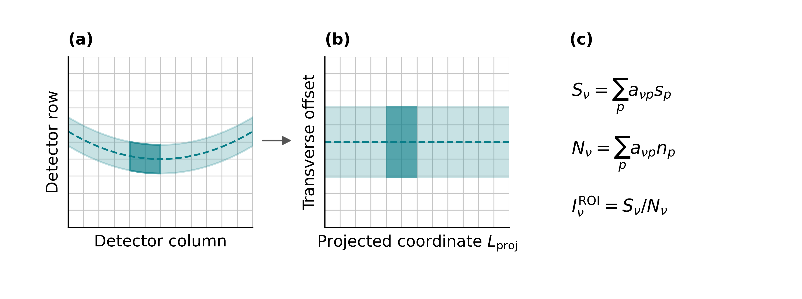

# Orientation and detector integration

This chapter preserves the manuscript's former Supporting Information section S3,
**Ewald selection and detector profiles**, transferred on 2026-10-09. The
[original LaTeX source](s3-ewald-selection-and-detector-profiles.tex) retains its
equation labels, citations and review identifiers P21–P25. The chapter below
adapts document links and formatting while preserving the calculation.

## Scope and software conventions

The manuscript's signed $\alpha$ and azimuth $\beta$ locate one reciprocal-vector
direction after averaging compatible crystallite orientations. The rotation
angles $\alpha_{\mathrm n},\phi_{\mathrm n},\psi_{\mathrm c}$ below instead specify
a complete crystallite: every reciprocal vector shares the same rotation.

The [current native architecture](../ARCHITECTURE.md#selected-fitting-workflow)
declares spherical normal probability with independent uniform crystal spin
through <code>fiber_detector</code> and <code>conditional_detector</code>. The
[implementation contracts](../CONTRACTS.md#native-bi-cell-site-and-morphology-refinement-v15)
state that path's source, optical, detector and finite-region scope.
Older/direct APIs retain their declared tied-rotation or flat-angle laws.
Use the selected API's [result measure](../RESULT_MEASURE.md) when relating
these equations to runtime outputs.

Frames, active rotations and units follow [Mathematical conventions](../CONVENTIONS.md).
The detector-coordinate Jacobian below converts accepted reciprocal area to
detector coordinates. It already accounts for the geometric solid angle.
The [detector-coordinate measure](../RESULT_MEASURE.md#detector-coordinate-measure)
therefore includes this factor once.

Here $I_{hk\ell}(\lambda_s)=|F_{hk\ell}(\lambda_s)|^2$ is the discrete-reflection
structural strength, with structure factor $F_{hk\ell}$ and source wavelength
$\lambda_s$. The normal repeat $c$ gives $|\mathbf c^*|=2\pi/c$.
The continuous rod strength $S_{hk}(L,\lambda_s)$ is a
density per unit $L$, with the declared whole-stack or per-layer normalization.
Population and optical factors enter separately as shown below.

## Ewald selection and detector profiles

Orientation probability distributes structural weight, the Ewald condition selects elastic scattering, and finite pixels collect the accepted rays. Discrete reflections and continuous rods pass through these same three steps.

## Crystallite orientation and probability

Mosaicity redistributes a fixed structural weight, so the orientation probability integrates to one. A shared rotation keeps each crystallite's reciprocal vectors together. In an orthonormal crystal frame with $\hat{\mathbf e}_3=\mathbf c^*/|\mathbf c^*|$, $\mathbf R_z$ and $\mathbf R_y$ are right-handed rotations about $\hat{\mathbf e}_3$ and $\hat{\mathbf e}_2$. The rotation $\mathbf C$ places this frame in sample coordinates, with $\mathbf C\hat{\mathbf e}_3=\hat{\mathbf n}$ along the mean film normal. All Ewald vectors use these sample coordinates:

$$
\begin{aligned}
 \mathbf R=\mathbf C\mathbf R_z(\phi_{\mathrm n})\mathbf R_y(\alpha_{\mathrm n})\mathbf R_z(\psi_{\mathrm c}),
 \qquad \mathbf G'=\mathbf R\mathbf G,\\
 dP=p_m(\alpha_{\mathrm n})d\alpha_{\mathrm n}
       \frac{d\phi_{\mathrm n}}{2\pi}\frac{d\psi_{\mathrm c}}{2\pi}.
 \end{aligned}
$$

Here $\alpha_{\mathrm n}\in[0,\pi]$ is the tilt magnitude for directed normals. Tilt azimuth $\phi_{\mathrm n}$ and independent basal rotation $\psi_{\mathrm c}$ are uniform on $[0,2\pi)$. Equal tilt intervals cover different spherical areas, giving $p_m(a)=2\pi f_m(a)\sin a$ and $\int_0^\pi p_m(a)da=1$.

Equivalent rotations have the same component weight. We therefore wrap the Gaussian and Lorentzian functions with period $2\pi$,

$$
\begin{aligned}
 \omega_{\mathrm G}(a;\sigma)
 &=\sum_{n=-\infty}^{\infty}
 \frac{\exp[-(a+2\pi n)^2/(2\sigma^2)]}{\sqrt{2\pi}\sigma},\\
 \omega_{\mathrm L}(a;\Gamma)
 &=\sum_{n=-\infty}^{\infty}
 \frac{\Gamma/\pi}{(a+2\pi n)^2+\Gamma^2}.
 \end{aligned}
$$

Angles are in radians. The positive widths $\sigma$ and $\Gamma$ are the Gaussian standard deviation and Lorentzian half-width before wrapping. For $i\in\{\mathrm G,\mathrm L\}$, use $f_i(a)=\omega_i(a)/Z_i$ with $Z_i=2\pi\int_0^\pi\omega_i(b)\sin b\,db$. Then $f_m=(1-P_{\mathrm L})f_{\mathrm G}+P_{\mathrm L}f_{\mathrm L}$ has the stated integrated component probabilities.

Several crystallite normals can give the same reciprocal-vector direction. Their average gives its probability density per steradian $A_m$ and per tilt-arc interval $w_m$. For a vector at angle $\vartheta$ to the crystallite normal and polar angle $\theta$ about the mean film normal,

$$
\begin{aligned}
 A_m(\theta,\vartheta)&=\frac{1}{2\pi}\int_0^{2\pi}
 f_m\!\left[\arccos(\cos\theta\cos\vartheta+\sin\theta\sin\vartheta\cos\xi)\right]d\xi,\\
 w_m(\alpha\mid\vartheta)&=2\pi A_m(\vartheta+\alpha,\vartheta)\sin(\vartheta+\alpha).
 \end{aligned}
$$

The angle $\xi$ runs over compatible local normals. The manuscript $w(\alpha)=w_m(\alpha\mid\vartheta)$ is normalized on $-\vartheta\leq\alpha\leq\pi-\vartheta$. For positive $(00\ell)$, the vector follows its normal, giving $w_m(\alpha\mid0)=p_m(\alpha)$. Compatible normals can have different incidence and exit angles, so optical weights remain inside their orientation average.

To place a raw rotation in this pole-to-pole domain, set $\theta_{\mathrm{raw}}=\vartheta+\alpha_{\mathrm{raw}}$, $\theta=\arccos(\cos\theta_{\mathrm{raw}})$ and $\alpha=\theta-\vartheta$. If $\sin\theta_{\mathrm{raw}}<0$, add $\pi$ to the raw azimuth before reducing it modulo $2\pi$. Otherwise reduce the raw azimuth directly modulo $2\pi$. This folding preserves the vector direction, with azimuth immaterial at either pole.

## Bragg-point curve and pixel intervals

Elastic scattering selects a circle on the Bragg sphere, and a pixel receives the portions whose exit rays cross it. [Als-Nielsen and McMorrow (2001)](#references) For reflection $(h,k,\ell)$ and source state $s$, let $G=|\mathbf G_{hk\ell}|$, $\theta=\vartheta+\alpha$ and $K_s=|\mathbf k'_{i,s}|$. The manuscript map is $\mathbf G'=G(\sin\theta\cos\beta,\sin\theta\sin\beta,\cos\theta)$. We measure distance from the elastic condition by the radial wavevector mismatch

$$
g(\alpha,\beta)=|\mathbf k'_{i,s}+\mathbf G'(\alpha,\beta)|-K_s.
$$

Rescaling the mismatch rescales the selected density. Reflections and rods therefore use this radial convention with a common count scale. With $\mathbf k'_{i,s}=(k_\perp\cos\varphi_i,k_\perp\sin\varphi_i,k_z)$, the selected azimuths at each $\alpha$ are

$$
c_E(\alpha)=\frac{-G/2-k_z\cos\theta}{k_\perp\sin\theta},
  \qquad
  \beta_\pm(\alpha)=\varphi_i\pm\arccos c_E(\alpha),
  \quad |c_E|<1,
$$

for $k_\perp\sin\theta>0$, with azimuths reduced modulo $2\pi$. Let $j$ label a branch with allowed range $\mathcal A_j$. Its selected vector $\mathbf G'^E_j(\alpha)=\mathbf G'(\alpha,\beta_j(\alpha))$ traces the circle $\mathbf k'_{i,s}\cdot\mathbf G'=-G^2/2$.

For a fixed mismatch interval, a shallower crossing admits a larger azimuth interval. The crossing factor $J_{\beta,j}$ accounts for this when the Dirac delta $\delta(g)$ selects the elastic part of $I_{hk\ell}(\lambda_s)w_m(\alpha\mid\vartheta)d\alpha\,d\beta/(2\pi)$. Let $\overline W_j$ average optical factors over the conditional orientation probability at $\mathbf G'^E_j$. The selected intensity per $d\alpha$ is

$$
\begin{aligned}
  \mathcal I^E_j(\alpha)
   &=\frac{I_{hk\ell}(\lambda_s)w_m(\alpha\mid\vartheta)}{2\pi}
     J_{\beta,j}\,\overline W_j(\alpha),\\
  J_{\beta,j}
   &=\left|\partial_\beta g\right|_{\beta_j}^{-1}
    =\frac{K_s}{Gk_\perp\sin\theta\sqrt{1-c_E(\alpha)^2}}.
 \end{aligned}
$$

The manuscript calls this $I(\alpha)$. A pixel collects the intervals $\mathcal A_{pj}$ whose exit rays it accepts:

$$
I_{p,hk\ell,s}=\sum_j\int_{\mathcal A_{pj}}\mathcal I^E_j(\alpha)\,d\alpha,
 \qquad I_p=\sum_s w_s\sum_{hk\ell}I_{p,hk\ell,s}.
$$

The normalized source weights $w_s$ follow the [source measure](../RESULT_MEASURE.md#source-measure). A single crossing has $\mathcal A_{pj}=[\alpha_-,\alpha_+]$, as in the manuscript. These intervals already include pixel acceptance. Replacing $\mathcal A_{pj}$ by $\mathcal A_j$ gives the full selected reflection intensity.

At $|c_E|=1$ or a pole, use an integrable limit or a smooth parameter along the circle. For $k_\perp=0$, the circle has constant $\alpha$ and $\beta$ is a suitable parameter. Exact sphere tangency at $G=2K_s$ requires a finite-resolution limit. The formulas above apply where their denominators are nonzero.

Parameters for the Bragg-arc and detector-mapping panels remain in the manuscript supplement's Figure parameters and display settings section.

## Continuous rods and detector intensity

A continuous rod adds the position $L$ to the orientation selection. First hold the basal angle $\psi_{\mathrm c}$ fixed, then average once over $d\psi_{\mathrm c}/(2\pi)$. Its dependence remains in all roots, derivatives and optical weights below.

The basal offset $\mathbf q_{hk}$ and rod direction $\mathbf d_{hk}$ share the crystallite rotation, keeping the rod rigid as it tilts:

$$
{\mathbf G'}_{hk}({\alpha_{\mathrm n}},{\phi_{\mathrm n}},L)
  =\mathbf q_{hk}({\alpha_{\mathrm n}},{\phi_{\mathrm n}})
  +L\,\mathbf d_{hk}({\alpha_{\mathrm n}},{\phi_{\mathrm n}}),
  \qquad
  \mathbf q_{hk}={\mathbf G'}_{hk}({\alpha_{\mathrm n}},{\phi_{\mathrm n}},0),
  \qquad
  \mathbf d_{hk}=\frac{\partial{\mathbf G'}_{hk}}{\partial L}.
$$

Elastic selection uses the fixed incident phase-sphere approximation and [phase-wavevector conventions](../CONVENTIONS.md#wavevectors), with real internal incident vector $\mathbf k'_{i,s}$ and $K_s=|\mathbf k'_{i,s}|$. This sphere is exact for propagating elastic waves in a homogeneous nonabsorbing medium. In an absorbing medium, direction-dependent real-vector magnitudes make it an approximation. The selected $L$ values solve $A_E L^2+B_E L+C_E=0$, where $A_E=\mathbf d_{hk}\cdot\mathbf d_{hk}$, $B_E=2\mathbf d_{hk}\cdot(\mathbf k'_{i,s}+\mathbf q_{hk})$ and $C_E=|\mathbf k'_{i,s}+\mathbf q_{hk}|^2-K_s^2$. For $\Delta_E=B_E^2-4A_EC_E>0$,

$$
L_{hk,j,s}({\alpha_{\mathrm n}},{\phi_{\mathrm n}})
  =\frac{-B_E\pm\sqrt{\Delta_E}}{2A_E},
  \qquad
  {\mathbf G'}^{E}_{hk,j,s}({\alpha_{\mathrm n}},{\phi_{\mathrm n}})
  ={\mathbf G'}_{hk}\!\left[{\alpha_{\mathrm n}},{\phi_{\mathrm n}},L_{hk,j,s}({\alpha_{\mathrm n}},{\phi_{\mathrm n}})\right].
$$

A negative $\Delta_E$ means the rod misses the sphere, and zero gives tangency. Retain roots $j$ satisfying $g_{hk,s}=|\mathbf k'_{i,s}+\mathbf G'_{hk}|-K_s=0$, exit propagation and detector acceptance. At a given reciprocal point, include every compatible orientation.

Equal intervals of tilt, azimuth and $L$ cover different reciprocal volumes. Their volume factor is

$$
d^3G'=J_{\mathrm{vol},hk}\,d\alpha_{\mathrm n}\,d\phi_{\mathrm n}\,dL,
 \qquad
 J_{\mathrm{vol},hk}=\left|\det\left[
 \partial_{\alpha_{\mathrm n}}\mathbf G'_{hk},
 \partial_{\phi_{\mathrm n}}\mathbf G'_{hk},\partial_L\mathbf G'_{hk}\right]\right|.
$$

For a fixed mismatch interval, a rod near tangency contributes a longer interval of $L$. Its crossing factor is

$$
J_E=\frac{1}{|\partial_L g_{hk,s}|}
 =\frac{K_s}{|\mathbf k'_{f,s}\cdot\mathbf d_{hk}|},
 \qquad \mathbf k'_{f,s}=\mathbf k'_{i,s}+\mathbf G'^E,
$$

evaluated at $L_j=L_{hk,j,s}$. Tangencies and zero determinants require a limiting or finite-region treatment.
Before elastic selection, each rod interval contributes $S_{hk}(L,\lambda_s)dL\,dP$. Applying $\delta(g_{hk,s})$ selects its allowed $L$ values with the same mismatch convention as the Bragg reflection. At fixed $\psi_{\mathrm c}$, each root contributes

$$
dI_{hk,j,s\mid{\psi_{\mathrm c}}}^{E}
  =\frac{p_m({\alpha_{\mathrm n}})}{2\pi}S_{hk}(L_j,\lambda_s)
   J_E\,d{\alpha_{\mathrm n}}\,d{\phi_{\mathrm n}}.
$$

The same angular interval covers Ewald area $dA_{G'}=J_EJ_{\mathrm{vol},hk}\,d\alpha_{\mathrm n}\,d\phi_{\mathrm n}$. Thus $J_E$ cancels when selected intensity is divided by area. The resulting density $\rho_{G',s}^E$ sums all compatible rods, roots and orientations and averages over the basal angle. Each contribution has weight $W_{hk,j,s}$ containing the individual-rod population $P_{hk}$ and local-normal optical factors, each once.

Detector areas accept different reciprocal-space areas as ray direction and detector pose change. For a detector point's internal momentum transfer $\mathbf G'_s(c_D,r_D)$, the area factor is

$$
J_{\mathrm{det},s}
  =\left|
  \frac{\partial{\mathbf G'}_s}{\partial c_D}
  \times
  \frac{\partial{\mathbf G'}_s}{\partial r_D}
  \right|,
  \qquad
  dA_{G'}=J_{\mathrm{det},s}\,dc_D\,dr_D.
$$

Multiplying $\rho_{G',s}^E$ by $J_{\mathrm{det},s}$ gives intensity per detector-coordinate area:

$$
I_{\mathrm{det},s}(c_D,r_D)
  =\int_0^{2\pi}\frac{d{\psi_{\mathrm c}}}{2\pi}\sum_{\mathrm{compatible}}
  W_{hk,j,s}
  \frac{p_m({\alpha_{\mathrm n}})}{2\pi}S_{hk}(L,\lambda_s)
  \frac{J_{\mathrm{det},s}}{J_{\mathrm{vol},hk}},
$$

The sum includes every rod, root and orientation reaching $\mathbf G'_s(c_D,r_D)$ at fixed $\psi_{\mathrm c}$. Keeping $W_{hk,j,s}$ inside the average retains its local-normal dependence. Source averaging and finite pixels then give

$$
I_{\mathrm{det}}(c_D,r_D)=\sum_s w_sI_{\mathrm{det},s}(c_D,r_D),
  \qquad
  I_p=\int_{\mathrm{pixel}\;p}I_{\mathrm{det}}(c_D,r_D)\,dc_D\,dr_D.
$$

The detector factor already includes solid angle, pose, distance, source-point parallax and exit refraction.

The volume factor already includes azimuthal arc length and distance per unit $L$. For the cylinder representation, the area factor is $G_R|\mathbf c^*|$, with $dA_{\mathrm{cyl}}=G_R|\mathbf c^*|d\beta\,dL$ for $G_R>0$. The [detector-density equation](#eq-si-detector-density-sequential-jacobians) uses $J_{\mathrm{vol},hk}$.

## Specular rod and evaluation at detector points

For $(00L)$, the basal offset and cylinder circumference vanish, so use the rod directly. Write $\mathbf G'(q_z)=q_z\hat{\mathbf d}$ with unit local-normal direction $\hat{\mathbf d}$. The Ewald roots are

$$
q_z=0,
\qquad q_z=-2\mathbf k'_i\cdot\hat{\mathbf d},
\qquad L=\frac{q_z}{|\mathbf c^*|}.
$$

The zero root is the direct beam. The rod is independent of $\psi_{\mathrm c}$. When optical weights depend only on the local normal, the normalized basal-angle integration contributes a factor of one.

At a prescribed detector point, the outgoing air ray and exit refraction give $\mathbf k'_{f,s}$ and $\mathbf G'_s=\mathbf k'_{f,s}-\mathbf k'_{i,s}$. The [detector-density equation](#eq-si-detector-density-sequential-jacobians) then collects the contributing rods, orientations and $L$ values. For integration over outgoing directions, use intensity per internal solid angle $K_s^2\rho_{G',s}^E$, since $dA_{G'}=K_s^2d\Omega$.

## Finite integration and projected coordinates

A profile point averages a finite detector band that can cross pixel boundaries. Measured and calculated images use the same reference map, bands and fractional pixel overlaps in the $2\theta$--$\phi_f$ representation. [Ashiotis et al. (2015)](#references)

A detector bin can receive several crystallite orientations, so its display coordinate uses the mean film normal $\hat{\mathbf n}$ and reference beam. For the calibrated vector $\mathbf G'$,

$$
{\mathbf G'}_{\parallel}
={\mathbf G'}-({\mathbf G'}\cdot\hat{\mathbf n})\hat{\mathbf n},
\qquad
{G'_R}=|{\mathbf G'}_{\parallel}|,
\qquad
{G'_z}={\mathbf G'}\cdot \hat{\mathbf n},
\qquad
L_{\mathrm{proj}}=\frac{{G'_z}}{|\mathbf c^{*}|}=\frac{{G'_z} c}{2\pi},
$$

where ${\mathbf G'}_{\parallel}$ lies in the film plane. Intrinsic $L$ follows each tilted crystallite rod, while $L_{\mathrm{proj}}$ labels the displayed projection. The physical calculation retains each source state's $\mathbf G'_s$. The hexagonal index $r\equiv h^2+hk+k^2$ groups rods of reference radius $G_R(r)$, with individual structure factors.

A band around the broadened trajectory selects $|{G'_R}-{G'_{R,0}}|\le\Delta{G'_R}$ and ${G'_{z,\min}}\le {G'_z}\le {G'_{z,\max}}$ in both images. Here $\Delta{G'_R}$ is the radial half-width about target radius ${G'_{R,0}}$. The coordinate map makes this band curved in the $2\theta$--$\phi_f$ display.

To average the accepted area, apply the same fractional weights to signal and normalization. Let $M^{\mathrm{cake}}_{bp}$ be the overlap fraction of detector pixel $p$ with remapped bin $b$, and $\mu_{\nu b}$ the mask or interpolation weight for profile point $\nu$. The combined weight $a_{\nu p}$ acts on signal $s_p$ and normalization $n_p$:

$$
I_{\nu}^{\mathrm{ROI}}=
\frac{\sum_p a_{\nu p}s_p}
     {\sum_p a_{\nu p}n_p},
\qquad
 a_{\nu p}=\sum_b \mu_{\nu b}M^{\mathrm{cake}}_{bp},
$$

with positive accumulated normalization. Each finite-band average is labeled by $G'_z$ or $L_{\mathrm{proj}}$.

Construction of a finite-region detector profile. (a) A curved band crosses native detector pixels. Teal marks accepted area, with one profile interval darker. (b) The coordinate map straightens the band and retains that interval. Gray lines mark pixel or bin boundaries, and the dashed line marks the trajectory center. (c) Signal and normalization pass through the same overlap and mask weights before their sums are divided.

[Vector PDF](figures/profile_construction_guide.pdf).

This integration defines the finite-region comparison used for ordered-film and selected PbI$_2$ profiles. See [Fitting workflow and figures](../FITTING_WORKFLOW.md) for measurement comparisons, uncertainty and figure settings.

## References

1. J. Als-Nielsen and D. McMorrow, *Elements of Modern X-ray Physics*
   (Wiley, 2001), ISBN 9780471498582.
2. G. Ashiotis et al., “The fast azimuthal integration Python library: pyFAI,”
   *Journal of Applied Crystallography* **48**, 510–519 (2015).
   [DOI: 10.1107/S1600576715004306](https://doi.org/10.1107/S1600576715004306).
