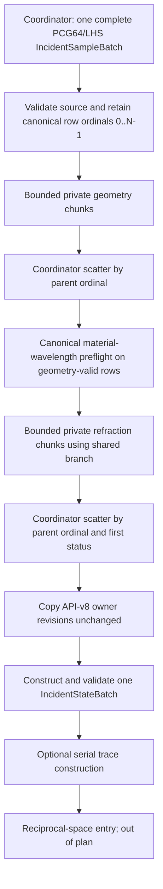

# Incident-beam source-to-film-\(k_i\) execution plan

Status: read-only implementation plan; no production or test implementation is authorized by this
document. The scope starts with one canonical Monte Carlo source realization and ends when the
authoritative `IncidentStateBatch` owns `k_film_phase_sample_Ainv` and its aligned incident payload.
It excludes Ewald/coating work, outgoing \(k_f\), detector projection, deposition, and fitting.

Integration baseline: contract API v8 on accepted `main` merge
`a4beb5913d9352864bc24cae77705bb86f44933b`. API v8 makes `MaterialOptics` and
`CompiledInstrument` the sole owners of their v2 material and sample-geometry revisions;
incident transport copies those revisions and never reconstructs either digest.

The required repository instructions, architecture/contract documents, validation material,
reference-pack instructions, `tasks/plan.md`, and
`tasks/parallel_simulation_geometry_fitting_plan.md` were read before this plan was written. The
latter freezes `src/rasim_next/geometry/transport.py` after BKI-15
(`tasks/parallel_simulation_geometry_fitting_plan.md:47-57,71-76`), so any implementation below
requires a separately reviewed ownership grant before that file is changed.

## 1. Existing call graph and exact \(k_i\) ownership boundary

The current path is:

1. `sample_gaussian_source_rays` validates one source declaration
   (`src/rasim_next/sampling/source.py:30-77`), creates one PCG64 generator and one complete
   \(N\times5\) Latin-hypercube realization (`:79-113`), vectorizes position, divergence direction,
   and wavelength (`:115-120`), assigns row IDs, exact empirical mass `1/N`, polarization, and
   provenance (`:124-161`), and constructs exactly one `IncidentSampleBatch` (`:162-173`). Adjacent
   antithetic pairs and the odd final central ray are fixed during this one realization.
2. `IncidentSampleBatch.__post_init__` C-copies and freezes the aligned source arrays, validates
   unique IDs, unit directions, exact mass, and source metadata, and computes the parameter and
   complete-realization revisions (`src/rasim_next/core/contracts.py:276-347`). The canonical hash
   encoding is typed, little-endian, C-order, length-prefixed, and field-name ordered
   (`:83-160`).
3. `simulate_ordered` accepts that already complete batch and calls `build_incident_states`
   (`src/rasim_next/pipeline/simulate.py:365-405`). There is no downstream source resampling.
4. `build_incident_states` validates the three authorities and processes the whole source batch
   (`src/rasim_next/geometry/transport.py:141-155`):
   - `_intersect_sample_rays` performs vectorized LAB/sample intersection, transforms, footprint,
     and first-failure classification (`:157-169`; implementation in
     `src/rasim_next/geometry/sample.py:41-121`). `CompiledInstrument` derives and freezes the
     inverse transform and v2 sample-geometry revision once
     (`src/rasim_next/geometry/instrument.py:150-210`), while the point and
     vector matrix operations remain `RigidTransform.apply_point/apply_vector`
     (`src/rasim_next/core/transforms.py:63-73`);
   - full-size result arrays are initialized once (`transport.py:171-176`);
   - only geometry-valid source-row ordinals are compacted into the incident refraction solve
     (`:178-187`);
   - geometry and optical outputs are scattered back to their original source-row ordinals
     (`:189-194`);
   - the owner-computed sample-geometry and material revisions are copied unchanged (`:219-220`);
     `MaterialOptics` owns its v2 revision at `src/rasim_next/core/contracts.py:351-385`; and
   - one authoritative `IncidentStateBatch` is constructed (`transport.py:198-222`).
5. `_solve_incident_mode_arrays` constructs air \(k_i\), conserves its SAMPLE-frame tangential
   components, selects the shared complex film-normal mode, and writes
   `k_film_phase[:, 2] = kz_film.real`
   (`src/rasim_next/optics/refraction.py:113-157`). The sole normal-wavevector equation and branch
   selector remain `normal_wavevector` and `select_normal_wavevector`
   (`src/rasim_next/core/wave_modes.py:16-61`).
6. The final film-side vector is scattered at
   `src/rasim_next/geometry/transport.py:192` and transferred into the contract field at `:204`.
   `IncidentStateBatch` declares and validates that field at
   `src/rasim_next/core/contracts.py:389-561`. This constructor is the ownership boundary: before
   it, \(k_i\) is private transport scratch; after it, the self-contained state batch is the only
   incident authority.
7. The first reciprocal-space reads are the valid-state bound at
   `src/rasim_next/pipeline/intersections.py:70-91` and the per-state attempt context at
   `src/rasim_next/reciprocal/events.py:136-151`; their public entry functions are respectively
   `build_intersection_support` (`intersections.py:281-296`) and `build_scattering_events`
   (`events.py:226-273`). Neither joins raw source data.

The boundary includes the attenuation inputs already carried by the state—film `kz`, entrance
amplitude, SAMPLE direction, intersection, and footprint—but not evaluation of attenuation. The
latter begins downstream (for example `src/rasim_next/geometry/transport.py:395-424`) and is out of
scope.

Canonical order means the incoming parent row ordinal, not sorted numeric ID. Generated IDs happen
to be `arange(N)`, but the contract permits unsorted IDs and permanent tests preserve `[42, 8]`
without sorting (`tests/test_geometry_optics.py:679-718`) and consume `[101, 100]` in that order
(`tests/test_mosaic_ewald.py:280-445`). The accepted controller rules likewise require explicit
`parent_row_index` reassembly and make `incident_state_id` identity payload rather than a sorting
key (`tasks/plan.md:106-109,523-534`).

## 2. Frozen scientific and reproducibility contracts

Every candidate must preserve all of the following:

- One serial, complete PCG64/LHS realization for the requested \(N\). A worker receives no seed,
  generator, sampler configuration, or authority to regenerate a row.
- Source row ordinal, exact `incident_sample_id`, antithetic adjacency, odd central row, wavelength,
  polarization, source mass `1/N`, source order, source parameter revision, and source realization
  revision.
- Radians, metres, angstroms, inverse angstroms, active column-vector transforms, LAB/SAMPLE frame
  ownership, and `float64`/`complex128` proof precision.
- Tangential wavevector conservation, real film phase \(k_i\), complex `kz` for decay, scalar
  entrance field amplitude, and the one shared complex-normal branch.
- First-failure status and payload. Geometry failures retain source identity/provenance but expose
  zero intersection, footprint, direction, air \(k_i\), film \(k_i\), film `kz`, and entrance
  amplitude. Optical failures retain the accepted intersection, SAMPLE direction, air \(k_i\),
  and footprint but expose zero film \(k_i\), film `kz`, and entrance amplitude. No survivor-mass
  renormalization is allowed.
- Exactly one public `IncidentStateBatch`, constructed only after canonical merge. A public worker
  slice is invalid because both source and state contracts require mass `1/len(batch)`
  (`src/rasim_next/core/contracts.py:306-307,433-434`); a slice retaining parent `1/N` can only be a
  private row view/result.
- Exactly one global source hash. API-v8 sample-geometry and material revisions are computed only by
  their complete immutable `CompiledInstrument` and `MaterialOptics` owners, respectively, then
  copied unchanged by transport. There is currently no content hash over all `IncidentStateBatch`
  output arrays; this plan does not add one or pretend a slice hash is the parent hash.
- Traced and untraced scientific fields remain identical. Trace records are constructed serially
  from the authoritative merged state, as they are now (`geometry/transport.py:223-317`).

No task may add a second physics equation, a beam wrapper, backend registry, scheduler framework,
plugin layer, mutable global cache, import-time worker pool, or worker-local scientific state.

## 3. Current measurements and parallelism candidates

### 3.1 Measurement environment and scale

Read-only profiling used Python 3.13.13, NumPy 2.2.6, SciPy 1.15.1, Windows 11, an Intel 24-core /
32-logical-CPU host with 68.5 GB RAM, and OpenBLAS 0.3.29. Timings are warm medians unless marked
cold; tracing was off. The immutable legacy GUI declares a 5,000-ray ceiling
(`reference/legacy_source/ra_sim/gui/_runtime/runtime_session.py:653-655`), so `N=5,000` is a
repository-backed production **proxy**, not a frozen claim about the current production workload.
IB-01 must obtain the current envelope. `N=50,000` is relevant to the legacy mosaic-fit minimum at
`:656`; `N=100,000` is a crossover stress case.

The timing table below was captured on the pre-v8 serial oracle. API v8 removes sample/material
digest construction from `build_incident_states` and replaces it with copies of owner-computed
revisions. IB-01 must therefore report fresh API-v8 serial measurements; the historical values are
candidate evidence only. Moving that small serial cost out of transport cannot strengthen the case
for an incident worker.

| Rays | Canonical source generation | Public incident transport | Source peak | Transport peak |
| ---: | ---: | ---: | ---: | ---: |
| 1 | 0.204 ms | 0.359 ms | 11.8 KB | 15.0 KB |
| 33 | 0.365 ms | 0.404 ms | 24.9 KB | 40.6 KB |
| 129 | 0.430 ms | 0.539 ms | 60.7 KB | 123 KB |
| 5,000 | 3.840 ms | 7.519 ms | 1.82 MB | 4.34 MB |
| 100,000 | 68.273 ms | 153.735 ms | 35.7 MB | 86.5 MB |

Retained numeric storage is approximately `72N` bytes for `IncidentSampleBatch` and `169N` bytes
for `IncidentStateBatch`, before Python tuple/string overhead.

On the pre-v8 oracle, 5,000 ordinary-incidence rays spent about 12% in intersection (about 2%
in the coordinate transforms themselves), 15% in refraction, 35% in final state copying and
contract validation, 36% in allocation/scatter/status assembly, and 2% in sample/material revision
hashing. API v8 moves that final 2% to the immutable owner constructors. Source generation at the
same size spent about 1.40 ms in full source hashing and 1.88 ms in the source contract constructor.
Those coordinator/owner costs bound worker speedup.

The accepted API-v8 geometry proof compared equivalent scalar and vector work at 512 rays: 16.8892
ms versus 0.9387 ms (17.99x), exact point and film-`kz` results, and a maximum
entrance-amplitude difference of `2.22e-16` (`docs/PERFORMANCE.md:86-93`). Increasing BLAS threads
from 1 through 24 did not improve the bulk kernel;
the transforms have inner dimension three and the remaining work is ufunc/search/memory traffic.

### 3.2 Ordinary-incidence candidates

| Equivalent work | Serial public path | Candidate | Outcome |
| --- | ---: | ---: | --- |
| 5,000 | 7.255 ms | two persistent threads, 7.023 ms | 1.03x; not material |
| 100,000 | 157.274 ms | four persistent threads, 124.901 ms | 1.26x; possible future crossover |
| 5,000 | about 7.3 ms | two reused processes, 16.61 ms | slower; cold first call about 299 ms |
| 100,000 | about 157 ms | two reused processes, 304.6 ms | slower; cold first call about 748 ms |

Threaded peak memory was 6.5–7.4% higher. Canonical scatter reproduced all 23 state fields exactly
in the prototype. Ordinary-incidence processes lose to serialization even when reused; shared
memory would add ownership and cleanup risk without curing cold imports or parent contract costs.

### 3.3 Near-critical cancellation candidate

`_normal_wavevectors` has one exceptional scalar loop for cancellation-sensitive rows
(`src/rasim_next/optics/refraction.py:59-86`). At 0.05 degrees, a deliberately cancellation-heavy
fixture sent every row through it:

| Rays | Intersection | Refraction | Public total |
| ---: | ---: | ---: | ---: |
| 5,000 | 0.974 ms | 83.645 ms | 87.839 ms |
| 50,000 | 10.356 ms | 852.250 ms | 893.612 ms |

Threads remained effectively one-core because the loop is Python/GIL-bound: at 5,000 rows, serial,
two-thread, and four-thread medians were 89.325, 85.651, and 89.726 ms. At 50,000 they were
904.622, 856.546, and 877.228 ms.

Reused processes preserved exact current results and improved this artificial all-cancellation
case: about 57.5–58.0 ms at 5,000 and 310.8 ms with four processes at 50,000. True cold startup was
about 320 ms, so the 5,000-row case needs roughly nine or more equivalent calls merely to amortize
startup. The current canonical Bi2Se3 script uses about 12-degree nominal incidence
(`scripts/generate_bi2se3_detector_image.py:54-73`), where this fallback does not trigger.

Deleting the scalar recovery is not an accepted optimization. For a varying near-critical
5,000-row fixture, 1,259 rows differed from the accepted scalar recovery; maximum film-normal
difference was `6.913e-14 A^-1` and the resulting entrance-amplitude difference could exceed its
absolute tolerance floor. A stable batched or compiled reformulation therefore requires an
independent numerical proof and must still use the one shared branch. Its apparent speed is not
evidence of equivalence.

### 3.4 Stage decision

| Stage | Current character | Decision now | Reconsider only when |
| --- | --- | --- | --- |
| PCG64/LHS realization and source provenance | one deterministic vectorized realization | serial coordinator, once | never worker-local |
| Source contract and complete-realization hash | linear memory/hash work | serial coordinator, once | no worker candidate |
| Sample intersection and footprint | bulk NumPy | one whole vectorized batch | measured production size crosses the end-to-end gate |
| Coordinate transforms | small matrix/vector NumPy | vectorized, serial outer call | no separate task; it is not a bottleneck |
| Ordinary refraction and film \(k_i\) | bulk NumPy plus shared branch | vectorized, serial outer call | actual production \(N\) is near 100,000 and threads pass all gates |
| Cancellation recovery | Python scalar exceptional path | preserve exactly; first measure incidence envelope | fallback fraction is routinely high and a stable batch or cold process proof wins |
| Status scatter and final contract | parent-order allocation/copies/validation | serial coordinator, once | never per worker |
| Owner revisions and trace provenance | owner-computed v2 digests plus trace JSON | copy immutable owner revisions; construct trace serially once | never per worker |

**Current recommendation:** do not add an executor to the production path. At the 5,000-row
legacy-backed proxy, ordinary-incidence two-thread speedup is only 1.03x (about 0.23 ms), processes
are slower, and the current canonical example does not enter the near-critical loop. Retain one
whole-batch NumPy call unless IB-01 freezes a materially different current production envelope. The
conditional worker design below is usable only after the focused ownership amendment required by
IB-03; it cannot bypass or implicitly reopen the accepted serial boundary, and it is not
authorization to implement both thread and process paths.

## 4. Conditional batch/worker dataflow

Only continue past the measurement gate in Task IB-01 if one concrete executor type passes the
selection criteria in Section 12. Select **one** of: threads for large ordinary NumPy work, or
processes for a sufficiently large/cancellation-heavy cold one-shot workload. Do not create a
runtime backend abstraction or an automatic regime selector.



The two-stage geometry/refraction barrier is deliberate. Exact material matching currently occurs
only for geometry-valid rows. Prechecking every source row would incorrectly reject a wavelength
on a row already invalidated by geometry; allowing workers to raise independently would make the
observed exception depend on completion order. The coordinator therefore merges geometry status
first, validates exact material availability for geometry-valid rows in parent order, and only then
dispatches optical work.

Each private task contains only:

- explicit parent row ordinals;
- read-only slices/copies of origin, direction, and wavelength needed for that stage;
- for geometry, the small immutable transform/support values; for optics, the canonically matched
  `n_complex` rows returned by the parent material lookup, never the complete material table; and
- no source ID regeneration, RNG, public batch, provenance calculation, hash, trace, or reciprocal
  object.

Each result contains only fixed-dtype numeric/status arrays plus its parent ordinals. It is a
private transport result, not a new beam type. The coordinator maintains at most one completed
result per in-flight task, verifies that every ordinal in `[0, N)` is supplied exactly once, and
scatters into preallocated full-size arrays. Completion order is never output order.

If a worker path is selected, `build_incident_states` receives the smallest explicit keyword surface:
`max_workers=1` and `row_batch_size=None` preserve the existing whole-batch path; positive explicit
values enable the one selected bounded implementation. If processes are selected, cold one-shot
speedup must be sufficient to create and close the pool inside the call. This scope does not own a
persistent fitting/session executor, and no global or hidden reusable pool is permitted.

## 5. Deterministic RNG and canonical merge semantics

1. The coordinator calls `sample_gaussian_source_rays` exactly once for the requested total \(N\),
   before any executor exists. It does not use `SeedSequence.spawn`, skip-ahead, per-chunk LHS, or
   concatenated worker realizations.
2. The complete `IncidentSampleBatch` remains authoritative and immutable. A worker sees values,
   never an RNG or a sampler declaration.
3. The canonical merge key is the zero-based parent row ordinal carried with a task. IDs are copied
   from the parent at final construction and are never used as sort keys.
4. The coordinator preallocates every full state field, records an ordinal-filled bitmap, rejects
   duplicate/out-of-range/missing ordinals, and scatters each returned row exactly once.
5. `incident_state_id`, `incident_sample_id`, source weight, wavelength, polarization, source
   provenance, and source revisions are copied directly from the complete parent in its original
   order. Workers cannot return replacements for these fields.
6. Sample-geometry and material revisions come from the complete immutable API-v8
   `CompiledInstrument` and `MaterialOptics` owners. The coordinator copies them unchanged into the
   one final contract, so revision ownership, contract copies, and validation cannot depend on
   packet count.
7. Scheduling, completion order, worker count, row-batch size, and contiguous/strided/reversed
   test layouts must not alter any output byte on the designated proof environment.

## 6. Memory ownership, copies, and serialization

- **Serial/current path:** retain the existing whole-array NumPy operations and single final
  contract copy. Do not chunk merely to claim boundedness; it would add status/result objects and
  repeated temporary allocation at 5,000 rows.
- **Thread candidate:** source, material, and instrument objects remain immutable parent-owned
  memory. Contiguous row views are read-only and zero-copy; workers allocate only their private
  stage outputs. Parent output arrays are the only full scratch authority. At most `max_workers`
  tasks may be in flight; an unbounded future queue is forbidden.
- **Process candidate:** send bounded raw numeric chunks and immutable scalar metadata by ordinary
  serialization, receive bounded numeric results, and construct no public contract in a worker.
  Do not pickle the complete source batch or complete material table per task. Measure cold imports,
  input/output bytes, aggregate child RSS, and copy time. Shared memory is rejected unless measured
  serialization alone prevents an otherwise qualifying process path; if that happens, stop for a
  new ownership review rather than adding it under this plan.
- **Finalization:** keep the existing defensive C-copy/freeze behavior in `IncidentStateBatch`.
  An “adopt worker buffer” fast path would change the contract and is not justified.
- **Tracing:** allocate trace records only after final state validation. Workers emit no JSON or
  diagnostic files.

The benchmark must report parent peak RSS and aggregate child peak RSS for processes; `tracemalloc`
alone is insufficient for multi-process memory. No proof artifact is written under the repository
root.

## 7. Invalid rows and exceptions

- Geometry status priority remains `PARALLEL`, then `BACKWARD`, then `OUTSIDE_SUPPORT`
  (`src/rasim_next/geometry/sample.py:84-106`). A later stage cannot overwrite an earlier failure.
- Geometry-valid rows alone enter material preflight and refraction. This preserves the current
  behavior in which an absent material wavelength on a geometry-invalid row is harmless
  (`tests/test_geometry_optics.py:679-718`).
- Refraction continues to emit the existing `VALID`/`NUMERIC_FAILURE` result and the public
  contract continues to permit `NO_SOLUTION`. No exception is converted into a scientific status
  and no invalid row is dropped.
- Contract errors and missing exact material rows are validated by the coordinator in canonical
  order before the relevant dispatch. Preserve the current exception type and message.
- Predictable domain/contract failures are prevalidated canonically before dispatch. For an
  unexpected worker exception, stop submitting higher-ordinal chunks and prevent construction or
  return of any public state. Chunks are submitted in increasing parent-ordinal order, so when a
  higher chunk reports failure every lower chunk has already been submitted. Never cancel a lower
  chunk: await all lower-ordinal outcomes, then re-raise the original failure associated with the
  smallest parent ordinal and preserve its type/message. Higher-ordinal pending work may be
  cancelled only after that ordering fact is established. Do not raise the first future that
  happened to finish.
- A worker crash, broken pool, missing result, duplicate ordinal, or shape/dtype mismatch is a hard
  deterministic error. There is no silent serial fallback, partial state, retry with new sampling,
  or survivor renormalization.

## 8. Frozen numerical equivalence policy

Two policies serve different purposes and must not be mixed:

1. **Execution-layout equivalence (required for any worker path):** on the same supported software
   and host environment, serial and worker results must have identical scalar metadata and
   byte-identical C-order contents for every aligned array, including floating, complex, Boolean,
   and Unicode arrays. Compare dtype and shape and then `view(np.uint8)`/`tobytes(order="C")`; plain
   `array_equal` is insufficient to distinguish signed zero. IDs, order, statuses, validity,
   polarization, masses, source fields, provenance strings, and all revisions/hashes are exact.
2. **Independent numerical/compiled candidate proof (investigation only):** if a stable
   reformulation of the cancellation recovery is proposed, compare it to scalar/analytic authority
   using the already versioned stage policy: for \(k\)-like fields,
   `atol=1.4210854715202206e-14` and `rtol=2.2737367544328376e-13` times the declared wavevector
   scale; for entrance amplitude, the same absolute floor and
   `rtol=4.547473508866709e-13` times the unit bound. Intersection/direction/footprint use their
   existing scale-aware policies in `docs/VALIDATION.md`. Discrete/status/branch identities remain
   exact. Passing this tolerance is necessary but does not authorize replacement; branch authority
   and independent proof must be reviewed first.

Any threaded or process candidate that calls the existing equations must pass the stricter first
policy. A tolerance may not hide a scheduling- or merge-induced difference.

## 9. Ordered dependency graph

```text
IB-00 API-v8 boundary/ownership reconciliation
  -> IB-01 representative workload + baseline benchmark gate
       -> [no measured benefit] STOP with serial NumPy (current expected result)
       -> [cancellation hotspot] IB-02 shared-call shape-equivalence gate
                                  -> [not equivalent] retain scalar recovery / consider workers
                                  -> [new numerical method needed] STOP for separate optical task
       -> [actual production envelope + worker evidence] STOP for focused dependency amendment
                                                -> IB-03 private row kernel + serial canonical merge
                                 -> IB-04 one bounded executor implementation
                                      -> IB-05 equivalence/exception/benchmark proof
                                           -> IB-06 contract documentation and handoff
```

IB-02 and IB-04 are not parallel branches to merge. IB-02 cannot change shared numerical code. If
it shows that a new formulation is needed, stop for a separately authorized cross-cutting optical
task; if that later task lands, re-run IB-01 before considering an executor. IB-04 selects one
executor type from measured evidence; it does not implement both.

## 10. Small implementation tasks

### IB-00 — Reconcile scope and ownership with the accepted API-v8 serial oracle

**Dependencies:** accepted API-v8 merge `a4beb5913d9352864bc24cae77705bb86f44933b`, the BKI-15
boundary, and explicit ownership approval for any later edit to `geometry/transport.py`.

**Files (0):** read `docs/ARCHITECTURE.md`, `docs/CONTRACTS.md`, and
`tasks/parallel_simulation_geometry_fitting_plan.md`; do not edit them in this task.

**Work:** confirm that accepted API v8 already freezes the complete canonical source, sole
self-contained `IncidentStateBatch`, owner-only revision computation, invalid payload rules, and
downstream attenuation boundary. The accepted parallel plan currently builds the complete incident
table once and serially before downstream dispatch. Because IB-01 is expected to terminate at
serial/no-go, do not add a hypothetical incident-worker seam to permanent architecture documents.
Any later worker candidate must first pass IB-01 and the focused dependency/ownership amendment.

**Acceptance:** the accepted documents point to the same last transport write and first reciprocal
read as Section 1, retain API-v8 owner revisions, and remain byte-clean against `main`; no document
says to sort numeric IDs, build public slice batches, or rehash chunks.

**Exact verification:**

```powershell
$env:PYTHONDONTWRITEBYTECODE='1'
$env:PYTHONPATH='src'
python -X utf8 tools/check_docs.py
python -X utf8 -m pytest -q -p no:cacheprovider tests/test_core_coordinates.py::test_minimal_contract_flow_preserves_event_identity_and_mass tests/test_geometry_optics.py::test_transport_preserves_identity_factors_and_first_failure tests/test_mosaic_ewald.py::test_event_builder_preserves_sparse_order_frames_and_factor_boundary
git diff --exit-code main -- docs/ARCHITECTURE.md docs/CONTRACTS.md
git diff --check
```

### IB-01 — Freeze the representative workload and make the go/no-go measurement

**Dependencies:** IB-00.

**Files (at most 4):** `src/rasim_next/geometry/proof.py`, `docs/PERFORMANCE.md`,
`docs/VALIDATION.md`, and, only after the final tracked set is frozen, `FILE_MANIFEST.json`. Do not
add a proof-dispatcher command or dependency at this gate.

**Work:** first obtain the actual production ray-count distribution, incidence-angle envelope,
fraction of geometry-valid rows, and fraction entering the cancellation recovery. Freeze
`N_production` and its source before any worker implementation. If the current envelope cannot be
obtained, use 5,000 only as a named legacy proxy, record that production-scale proof is unavailable,
and resolve immediately to serial/no-go. In that no-go branch, extend the existing
`geometry-optics` proof only if needed to report equivalent serial source/transport measurements at
`N={1,33,129,5000}` and the cancellation shape comparison; call the public serial
`build_incident_states` path and retain its authoritative `IncidentStateBatch`. Use seven measured
repetitions and report the applicable Section 11 metrics, including source/transport/end-to-end wall
time, setup time, peak memory, CPU utilization, ray count, validity/cancellation counts, retained
bytes, revisions, and environment; worker/chunk/serialization fields are explicitly not applicable.
Do not manually
construct a state, reproduce transport/merge/status/revision/hash logic, add an executor switch,
serialize full instrument/material objects per packet, add `psutil`, or create a thread/process
prototype. Record the measured candidate evidence already established in Section 3 and why it is
insufficient to authorize production work without a real production envelope.

After the exact plan copy, proof, and two decision documents are final and staged, refresh
`FILE_MANIFEST.json` exactly once so the committed candidate passes the repository seed verifier.
The manifest excludes itself and catalogs the sorted tracked set; it is required metadata, not a
benchmark artifact. Use the project MANIFEST algorithm without editing `scripts/verify_seed.py`:

```powershell
python -X utf8 -c "import hashlib,json,subprocess; from pathlib import Path; root=Path.cwd(); paths=sorted(raw.decode('utf-8') for raw in subprocess.check_output(['git','-c','core.quotepath=false','ls-files','-z']).split(b'\0') if raw and raw != b'FILE_MANIFEST.json'); files=[{'path': path, 'sha256': hashlib.sha256((root/path).read_bytes()).hexdigest(), 'size_bytes': (root/path).stat().st_size} for path in paths]; (root/'FILE_MANIFEST.json').write_text(json.dumps({'file_count': len(files), 'files': files}, indent=2)+'\n', encoding='utf-8', newline='\n')"
```

If an actual production envelope is available and the existing evidence indicates that a worker
candidate may pass Section 12, stop for a focused plan amendment that moves extraction of the one
private raw incident kernel ahead of process benchmarking. A proof-private transport clone is never
an acceptable way to break that dependency.

**Acceptance:** the production workload source or its absence is explicit; ordinary and
near-critical regimes remain distinguishable; any added proof code calls the public serial path and
does not duplicate state construction; the serial/no-go decision is reproducible from the existing
proof command and Section 3 measurements; and no new production API, executor prototype, proof
command, or dependency exists. With the currently documented lack of `N_production`, this task is
the terminal implementation decision. The final manifest contains the exact plan/proof/document
bytes and `python scripts/verify_seed.py` returns `PASS`.

**Exact verification:**

```powershell
$env:PYTHONDONTWRITEBYTECODE='1'
$env:PYTHONPATH='src'
$env:OMP_NUM_THREADS='1'
$env:MKL_NUM_THREADS='1'
$env:OPENBLAS_NUM_THREADS='1'
$env:NUMEXPR_NUM_THREADS='1'
python -X utf8 -m rasim_next.proof geometry-optics --json
python -X utf8 tools/check_docs.py
python -X utf8 -m ruff check src/rasim_next/geometry/proof.py
python -X utf8 -m ruff format --check src/rasim_next/geometry/proof.py
python -X utf8 scripts/verify_seed.py
git diff --check
```

### IB-02 — Close the cancellation question without changing shared physics

**Dependencies:** IB-01 shows a representative cancellation fraction large enough to matter.

**Files (2):** `docs/PERFORMANCE.md`, `docs/VALIDATION.md`. Any measurements remain in the existing
`geometry-optics` proof output or as external artifacts.

**Work:** use the fixed `cancellation_shape_equivalence` section of the existing `geometry-optics`
proof to compare vector-shaped and row-scalar calls to the existing shared authority at both
propagation signs and frozen cancellation edges. This tests whether merely batching the accepted
call meets the frozen policy; it does not retain an alternate implementation. Do not duplicate or
edit the normal-wavevector equation, and do not add a compiled dependency. If the shape comparison
fails, record the rejection and retain the current loop unchanged. Any genuinely new stable
formulation that would change `core/wave_modes.py`, exit refraction, attenuation, or Parratt
behavior is a separate cross-cutting optical-primitive task outside this incident-boundary plan.

**Acceptance:** the existing proof JSON reports both propagation signs and cancellation edges, exact
status/branch selection, Section 8 error, affected-row count, and the measured cost share of the
scalar recovery. It does not change production code, dependencies, outgoing optics, or the shared
branch. A failed shape-equivalence gate leaves no alternate branch, fallback flag, permanent test,
or repository artifact.

**Exact verification:**

```powershell
$env:PYTHONDONTWRITEBYTECODE='1'
$env:PYTHONPATH='src'
python -X utf8 -m pytest -q -p no:cacheprovider tests/test_core_coordinates.py::test_shared_coordinate_and_optical_primitives tests/test_geometry_optics.py::test_refraction_and_attenuation_equations
python -X utf8 -m rasim_next.proof core --json
python -X utf8 -m rasim_next.proof geometry-optics --json
python -X utf8 tools/check_docs.py
git diff --check
```

### IB-03 — Extract one private row kernel and prove serial canonical merge

**Dependencies:** IB-01 has an actual frozen production envelope and candidate evidence, any IB-02
change still passes the gate, the focused dependency amendment is accepted, and there is an
explicit ownership grant for the frozen transport consumer. That amendment must also reconcile the
accepted serial incident-table decision in `tasks/parallel_simulation_geometry_fitting_plan.md`;
this plan does not silently supersede it.

**Files (3):** `src/rasim_next/geometry/transport.py`,
`src/rasim_next/optics/refraction.py`, `tests/test_geometry_optics.py`.

**Work:** extract one private incident-only raw-array refraction kernel in `optics/refraction.py`.
The existing `_solve_incident_mode_arrays` performs its exact material lookup once and delegates to
that kernel; the coordinator may perform the same canonical lookup after geometry merge and pass
only direction, wavelength, and matched `n_complex` row chunks to that same kernel. It must continue
to call the unchanged shared normal-wavevector authority, and it does not alter the exit solver.
Add the two-stage geometry/material/refraction barrier and a parent-ordinal result merge in
`transport.py`. Keep the existing public call on whole-batch behavior; IB-04 may later map
`max_workers=1` to that same path. No worker creates `MaterialOptics`, `IncidentSampleBatch`, or
`IncidentStateBatch`; no equation duplicates. Validate exact material wavelengths only on
canonically merged geometry-valid rows. Copy the API-v8 owner revisions unchanged and construct the
public state and traces once in the coordinator.

**Acceptance:** the new serial one-chunk path is byte-identical to the pre-change state for
`N=1,33,129,5000`, all-valid/mixed/all-invalid geometry, ordinary/near-critical optics, unsorted
IDs, monochromatic and polychromatic sources, and tracing on/off. The pure merge rejects duplicate,
missing, and out-of-range ordinals. Current exception types/messages are unchanged.

**Exact verification:**

```powershell
$env:PYTHONDONTWRITEBYTECODE='1'
$env:PYTHONPATH='src'
python -X utf8 -m pytest -q -p no:cacheprovider tests/test_geometry_optics.py::test_incident_serial_row_kernel_matches_frozen_whole_batch tests/test_geometry_optics.py::test_incident_merge_requires_each_parent_ordinal_once tests/test_geometry_optics.py::test_transport_preserves_identity_factors_and_first_failure tests/test_geometry_optics.py::test_public_monochromatic_multi_ray_source_uses_one_exact_material_row tests/test_geometry_optics.py::test_incident_revision_ownership_and_excluded_instrument_fields
python -X utf8 -m rasim_next.proof geometry-optics --json
python -X utf8 -m ruff check src/rasim_next/geometry/transport.py src/rasim_next/optics/refraction.py tests/test_geometry_optics.py
python -X utf8 -m ruff format --check src/rasim_next/geometry/transport.py src/rasim_next/optics/refraction.py tests/test_geometry_optics.py
git diff --check
```

### IB-04 — Add exactly one bounded executor path

**Dependencies:** IB-03 and a still-passing IB-01 gate.

**Files (3):** `src/rasim_next/geometry/transport.py`,
`src/rasim_next/pipeline/simulate.py`, `tests/test_geometry_optics.py`.

**Work:** implement either bounded threads for a proven large ordinary-incidence workload or a
cold-call process path for a proven large/cancellation-heavy workload. Add only keyword-only
`max_workers` and `row_batch_size` to `build_incident_states`; if integration is required,
`simulate_ordered` forwards them as the explicitly incident-scoped `incident_max_workers` and
`incident_row_batch_size`. Do not add a backend argument, executor protocol, scheduler object,
persistent pool, or automatic angle-based selection. Bound in-flight work, merge only by parent
ordinal, and leave reciprocal entry unchanged. Downstream code receives only the final state.

**Acceptance:** worker count, chunk size, packet layout, scheduling, and completion permutation do
not change any output byte or exception; `max_workers=1` remains the accepted serial path; pool
startup/teardown cannot leak processes or threads; no worker RNG/hash/public batch exists; and the
selected path still passes the Section 12 speed and memory gate. If processes are selected, a fresh
Windows `spawn` interpreter proves that the worker target is module-level/picklable, imports do not
create a pool or recurse, and shutdown leaves no child. If any gate fails, revert IB-03/IB-04
production changes rather than retain an unused parallel option.

**Exact verification:**

```powershell
$env:PYTHONDONTWRITEBYTECODE='1'
$env:PYTHONPATH='src'
$env:OMP_NUM_THREADS='1'
$env:MKL_NUM_THREADS='1'
$env:OPENBLAS_NUM_THREADS='1'
$env:NUMEXPR_NUM_THREADS='1'
python -X utf8 -m pytest -q -p no:cacheprovider tests/test_geometry_optics.py tests/test_mosaic_ewald.py::test_event_builder_preserves_sparse_order_frames_and_factor_boundary
python -X utf8 -m rasim_next.proof geometry-optics --json
python -X utf8 -m rasim_next.proof mosaic-ewald --json
python -X utf8 -m ruff check src/rasim_next/geometry/transport.py src/rasim_next/pipeline/simulate.py tests/test_geometry_optics.py
python -X utf8 -m ruff format --check src/rasim_next/geometry/transport.py src/rasim_next/pipeline/simulate.py tests/test_geometry_optics.py
git diff --check
```

### IB-05 — Retain the compact equivalence proof and benchmark the selected path

**Dependencies:** IB-04.

**Files (at most 4):** `src/rasim_next/proof/__main__.py`,
`src/rasim_next/geometry/proof.py`, `tests/test_geometry_optics.py`, and conditionally
`pyproject.toml` only if reproducible process-tree metrics require a documented dev-only `psutil`
dependency. Never add the metrics tool to production dependencies/imports.

**Work:** after the selected public worker path exists, add one compact opt-in
`incident-transport-benchmark` command to the existing proof dispatcher/geometry proof owner. The
command must call the actual public serial and worker paths with the same canonical source and
scientific inputs; it must not contain a second transport implementation, manually construct an
`IncidentStateBatch`, or expose a generic executor-kind switch. Keep the large benchmark JSON
output external while the opt-in proof command owns the curated, versioned matrix; do not turn that
matrix into permanent pytest parameterizations. Retain one compact permanent
source/merge/status invariant and one reciprocal-boundary test command without editing reciprocal
tests. Exercise the deduplicated `N={1,33,129,5000,N_production,50000,100000}` set; test odd central
behavior at 1, 33, and 129.

**Acceptance:** all state fields pass the byte policy; IDs, antithetic pairs, odd center, exact mass,
wavelength, polarization, statuses, order, and revisions match; invalid payloads and canonical
exceptions match; the unchanged reciprocal entry continues to consume only the exact final
`IncidentStateBatch`, without a raw-source join or new wrapper; and the benchmark contains every
Section 11 metric. Every retained test is mapped to a unique long-term invariant; temporary sweeps
are removed from the repository.

**Exact verification:**

```powershell
$env:PYTHONDONTWRITEBYTECODE='1'
$env:PYTHONPATH='src'
$env:OMP_NUM_THREADS='1'
$env:MKL_NUM_THREADS='1'
$env:OPENBLAS_NUM_THREADS='1'
$env:NUMEXPR_NUM_THREADS='1'
python -X utf8 -m pytest -q -p no:cacheprovider tests/test_geometry_optics.py tests/test_mosaic_ewald.py::test_event_builder_preserves_sparse_order_frames_and_factor_boundary
python -X utf8 -m rasim_next.proof incident-transport-benchmark --json
python -X utf8 -m rasim_next.proof geometry-optics --json
python -X utf8 -m rasim_next.proof mosaic-ewald --json
python -X utf8 -m ruff check src/rasim_next/proof/__main__.py src/rasim_next/geometry/proof.py tests/test_geometry_optics.py
python -X utf8 -m ruff format --check src/rasim_next/proof/__main__.py src/rasim_next/geometry/proof.py tests/test_geometry_optics.py
git diff --check
```

### IB-06 — Update boundary documentation and perform the residue-free handoff

**Dependencies:** IB-05. Skip this implementation task if IB-01 selected serial and no code changed;
record the no-go benchmark in `docs/PERFORMANCE.md`/`docs/VALIDATION.md` instead.

The serial/no-go branch still runs the repository-wide handoff gate after its IB-01 manifest refresh;
skipping IB-06 means skipping worker-boundary documentation, not skipping final verification.

**Files (5):** `docs/ARCHITECTURE.md`, `docs/CONTRACTS.md`, `docs/DOVETAIL_MATRIX.md`,
`docs/PERFORMANCE.md`, `docs/VALIDATION.md`.

**Work:** document the one selected execution seam, exact merge and exception rules, measured
crossover, memory bound, default serial behavior, and rollback gate. Do not describe a generic
backend or expose worker packets as architecture. Remove all scratch harnesses, profiling output,
temporary tests, and unused alternatives from the repository.

**Acceptance:** documents agree with code and the frozen boundary; every retained file/test has a
permanent role; immutable examples/reference remain untouched; the full project gate passes; and
the final commit contains only intended incident-beam implementation, proof, test, and documentation
changes.

**Exact verification:**

```powershell
$env:PYTHONDONTWRITEBYTECODE='1'
$env:PYTHONPATH='src'
$env:PYTHONPYCACHEPREFIX = Join-Path $env:TEMP 'rasim_next_pycache'
$env:RUFF_CACHE_DIR = Join-Path $env:TEMP 'rasim_next_ruff_cache'
$pytestTemp = Join-Path $env:TEMP 'rasim_next_pytest'
python -X utf8 -m compileall -q src
python -X utf8 -m ruff check src tests scripts
python -X utf8 -m ruff format --check src tests scripts
python -X utf8 -m pytest -q -p no:cacheprovider --basetemp $pytestTemp
python -X utf8 tools/check_docs.py
python -X utf8 -m rasim_next.proof core --json
python -X utf8 -m rasim_next.proof incident-transport-benchmark --json  # only when IB-05 was reached
python -X utf8 -m rasim_next.proof geometry-optics --json
python -X utf8 -m rasim_next.proof mosaic-ewald --json
python -X utf8 -m rasim_next.proof references --json
python -X utf8 scripts/verify_seed.py
git diff HEAD --check
$protectedStatus = @(git status --porcelain -- examples reference)
if ($protectedStatus.Count -ne 0) { $protectedStatus; throw 'examples/reference changed' }
git diff --exit-code HEAD -- examples reference
git status --short
```

After the authorized coherent commit, require a clean worktree rather than merely inspecting it:

```powershell
$remaining = @(git status --porcelain)
if ($remaining.Count -ne 0) { git status --short; throw 'worktree is not clean after handoff commit' }
```

## 11. Required equivalence tests and benchmark protocol

### 11.1 Permanent equivalence matrix

The compact permanent suite must cover:

- counts `1`, `33`, and `129`, which jointly exercise singleton/odd center, many antithetic pairs,
  and chunk remainders;
- worker counts `1`, `2`, and `4`, plus chunk sizes `1`, `7`, `32`, `N`, and `N+1` for the selected
  executor;
- canonical contiguous input, test-only strided packets, reverse packet completion, and shuffled
  completion results, always scattered by original ordinal;
- all-valid, mixed geometry failures, all geometry-invalid, optical numeric failure constructed at
  the contract boundary, and a geometry-invalid row whose wavelength is absent from material;
- unsorted/sparse IDs, exact mass, polychromatic and monochromatic wavelength, polarization IDs,
  traces off/on, and ordinary/near-critical branch cases;
- exact serial/parallel exception type/message and no returned partial public state; and
- the unchanged reciprocal entry accepting only the exact final `IncidentStateBatch`, with no raw
  source join or new wrapper; no new reciprocal calculation is added to this plan.

For the serial/no-go branch, the required `N={1,33,129,5000}` comparisons belong in the existing
`geometry-optics` proof, not slow permanent pytest parametrizations. Only after IB-04 provides a
real selected public worker path may IB-05 add the opt-in benchmark for the separately frozen
`N_production` and `N={50000,100000}` stress/crossover cases. That benchmark must exercise the
public implementation rather than a proof-private transport clone. If no current production
envelope can be obtained, the report must say that production-scale proof is unavailable and may
make only a serial no-go decision from the 5,000-row proxy.

### 11.2 Equivalent-work benchmark

For every candidate/configuration, use the same already-created canonical source object, material,
instrument, tracing setting, and validity regime. Do not include source generation in “transport”
for one path and exclude it for another. Report three timings:

1. canonical source creation, including source contract and realization hash;
2. incident transport from that same source through final state construction; and
3. end-to-end source creation plus incident transport.

For processes, report true cold first call and any reused-pool experiment separately; reused-pool
evidence cannot justify this scope unless an explicit non-global lifecycle owner exists. Warm each
NumPy kernel without discarding cold executor setup. Use at least seven measured repetitions and
report median and p95, not only the best run.

Each record must include:

- wall time, executor/setup/teardown time, and parent-only finalization time;
- process CPU time, mean/effective CPU utilization, and physical/logical CPU counts;
- parent peak RSS, aggregate child peak RSS where applicable, and Python peak allocation;
- ray count, whether it is `N_production`, and the source/revision of that frozen production count;
- geometry-valid count, optical-valid count, and cancellation-row count/fraction;
- worker count, row-batch size, packet count/layout, maximum in-flight count, and completion order;
- serialized input/output bytes and copy time for a process candidate;
- source and state retained numeric bytes, source/geometry/material revisions, and external result
  digest;
- Python/NumPy/SciPy/BLAS versions, BLAS thread settings, OS, CPU, and precision; and
- exact-byte mismatch count per state field plus maximum absolute/scaled numerical error for an
  investigated compiled formulation.

On Windows, obtain physical/logical CPU counts and aggregate parent/child CPU and peak RSS through
the process tree only if the process candidate survives through IB-05. Prefer an already available
OS/proof tool; if reproducible collection then requires `psutil`, Task IB-05 may justify it only in
the dev dependency group rather than hand-rolling Win32 process APIs. The production package must
not import it.

Run ordinary incidence, the actual production angle envelope, the 0.05-degree all-cancellation edge,
mixed invalidity, and all geometry-invalid input. Tracing is off for the primary comparison and
measured separately to prove it remains parent-only. Benchmark outputs live outside the repository;
only concise durable conclusions belong in `docs/PERFORMANCE.md` and `docs/VALIDATION.md`.

## 12. Risks, open questions, rollback, and no-benefit criteria

### Open questions that must be closed before IB-03

1. What is the actual production distribution of \(N\), incidence angle, repeated evaluations, and
   cancellation-row fraction? The repository currently provides only a legacy-snapshot 5,000
   ceiling and a 20-row, roughly 12-degree canonical example.
2. Is an incident worker pool ever owned by a longer-lived in-scope operation? Fitting is explicitly
   outside this plan, so a persistent fitting/session pool cannot be assumed.
3. Do the BKI-15 and accepted parallel-plan owners approve reopening the frozen
   `geometry/transport.py` consumer and superseding the current serial incident-table decision after
   seeing the benchmark gate?
4. Can the cancellation recovery be stably batched while retaining the shared branch and accepted
   scalar result? The current naive vector value is not byte-equivalent.
5. If a process path uniquely qualifies, is ordinary serialization within the aggregate-RSS limit?
   Shared memory is not pre-authorized by this plan.

### Primary risks and mitigations

| Risk | Consequence | Mitigation / rollback trigger |
| --- | --- | --- |
| Worker-local sampling or slice reconstruction | different LHS, mass, IDs, hashes | workers accept raw immutable rows only; parent source is built once |
| Sorting by ID | corrupts permitted unsorted source order | merge exclusively by explicit parent ordinal |
| Per-chunk public batches | invalid `1/N` contract and rehashing | private result only; one final public constructor |
| Completion-dependent exception | nondeterministic failure | two-stage preflight and lowest-ordinal exception selection |
| Invalid payload leakage | downstream uses failed-stage values | zero-initialize parent fields and scatter only accepted stages |
| Duplicate normal-wavevector implementation | branch drift across optics | retain `core/wave_modes.py` as sole authority |
| Oversubscription | slower and nondeterministic timing | freeze BLAS threads to one during outer-worker proof |
| Process serialization/cold import | lost speed and excess RSS | measure true cold call and aggregate RSS; reject if gates fail |
| Windows `spawn` recursion or unpicklable worker | crash/hang or repeated pool creation | module-level worker, guarded coordinator, fresh-interpreter proof, no import-time pool |
| Executor/API bloat | permanent maintenance cost | one selected executor, two keyword controls, no backend object |
| Trace/provenance drift | hashes or diagnostics depend on packets | workers never compute revisions; copy v8 owner revisions and construct trace serially after canonical merge |

### Go/no-go thresholds

A worker implementation is justified only if, at the **frozen representative production size and
regime**, it simultaneously:

- saves at least 10 ms per source-to-state evaluation and reaches at least 1.25x median end-to-end
  speedup including required executor setup/teardown for the owned lifecycle;
- does not regress p95 by more than 5% and shows stable benefit across seven repetitions;
- keeps peak memory at or below 1.15x serial for threads, or an explicitly approved aggregate-RSS
  budget for processes;
- improves effective CPU utilization without oversubscription;
- passes the strict byte-equivalence, exception, payload, ordering, revision, and reciprocal-seam
  gates; and
- remains beneficial after any accepted algorithmic/vectorized improvement.

Parallel execution is **not beneficial** if the production crossover is above the frozen ray count,
if either the absolute or relative speed threshold fails, if cold setup cannot be owned/amortized in
scope, if memory/CPU variance breaches its bound, or if any scientific/reproducibility gate fails.
The current 5,000-row ordinary result fails both speed thresholds, so the present decision is serial
NumPy.

### Rollback

If IB-04 or IB-05 fails any gate, remove the executor controls, coordinator-specific worker code,
private result type, and implementation-detail tests; restore the single whole-batch path; retain
only independent scientific proof that still protects a unique invariant. A stable shared-branch
improvement could remain only if it was delivered by the separately authorized cross-cutting task,
passed its own proof, and was followed by IB-01 re-profiling; IB-02 itself cannot produce that
change. Do not leave a disabled feature flag, dormant backend, compatibility facade, scratch
benchmark, worker cache, or dual physics implementation.

The smallest accepted outcome is therefore allowed to be documentation of a measured no-go:
one canonical serial source realization, one whole-batch NumPy incident transport, and one
authoritative `IncidentStateBatch` at the reciprocal-space boundary.
